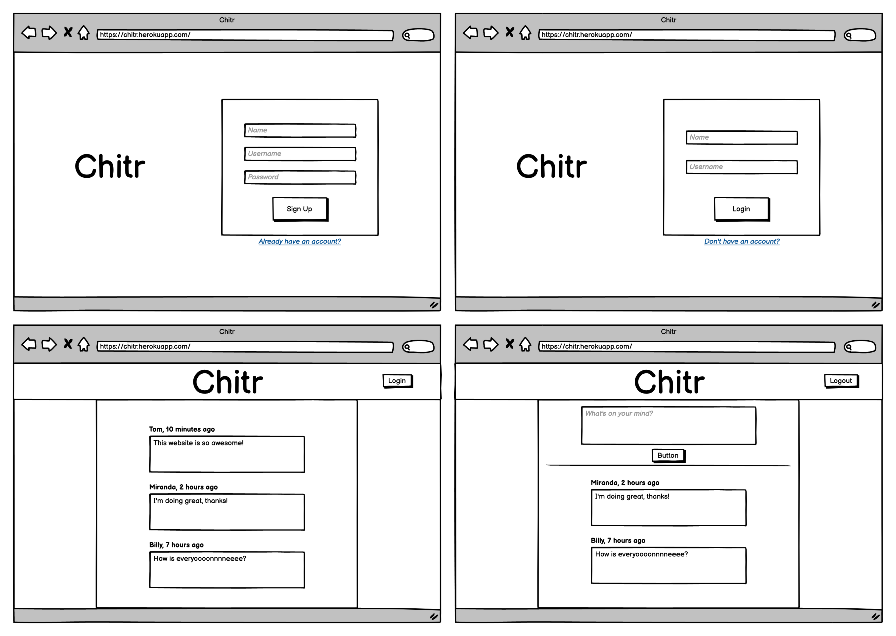

# Chitr

A simple Twitter clone

## Planning

### Stack

React
PostgreSQL
Node
Testing - Cypress (E2E), Jest, react-testing-library (unit)
Bootstrapped using create-react-app

### Development process

### Wireframes



### User stories

```
STRAIGHT UP

As a Maker
So that I can let people know what I am doing
I want to post a message (peep) to chitter

As a maker
So that I can see what others are saying
I want to see all peeps in reverse chronological order

As a Maker
So that I can better appreciate the context of a peep
I want to see the time at which it was made

As a Maker
So that I can post messages on Chitter as me
I want to sign up for Chitter

HARDER

As a Maker
So that only I can post messages on Chitter as me
I want to log in to Chitter

As a Maker
So that I can avoid others posting messages on Chitter as me
I want to log out of Chitter

ADVANCED

As a Maker
So that I can stay constantly tapped in to the shouty box of Chitter
I want to receive an email if I am tagged in a Peep
```

<!--
## How to use

### Hosted on Heroku

https://chitr.herokuapp.com/

### Host locally

-->
